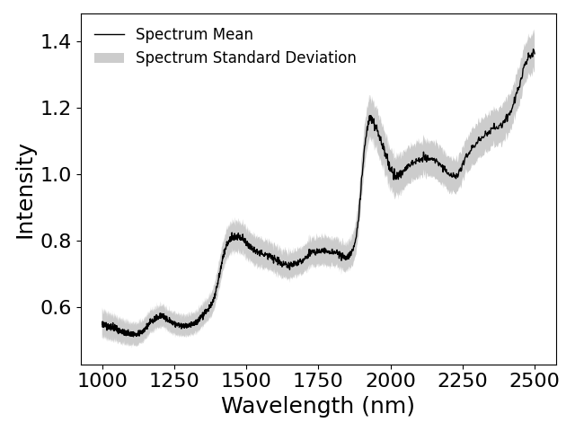

### Analysis pipeline on a kaggle synthetic chemometrics dataset.

Given a set of wavelength intensities and labeled fat and moisture content of chocolate, I aim to answer the question:
Which spectrum intensity features correlate to high or low fat and moisture content in chocolate?

  

data source: https://www.kaggle.com/datasets/aswatik/choclate-quality-analysis-dataset

